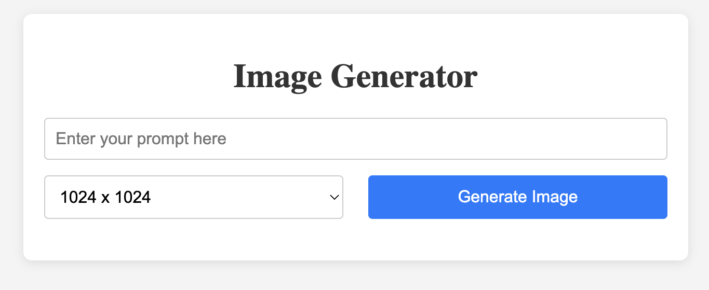
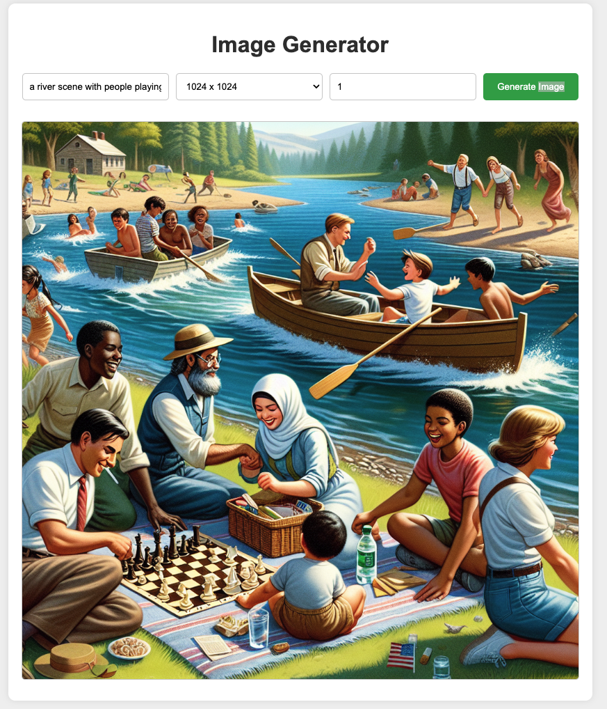

# Generative AI Image Generator

Simple front end that uses [dalle-3](https://openai.com/index/dall-e-3/) and a valid openAI key to generate images based on a user prompt.

## User Guide

1) Update the [app.js](app.js) with your valid openAI token.

1) Open the [main.html](main.html) file in your chosen browser, this will load the front end to interact with the app.

3) Enter a prompt, select the returned image size desired and then click `Generate Image`. The image will be returned in the front end.

